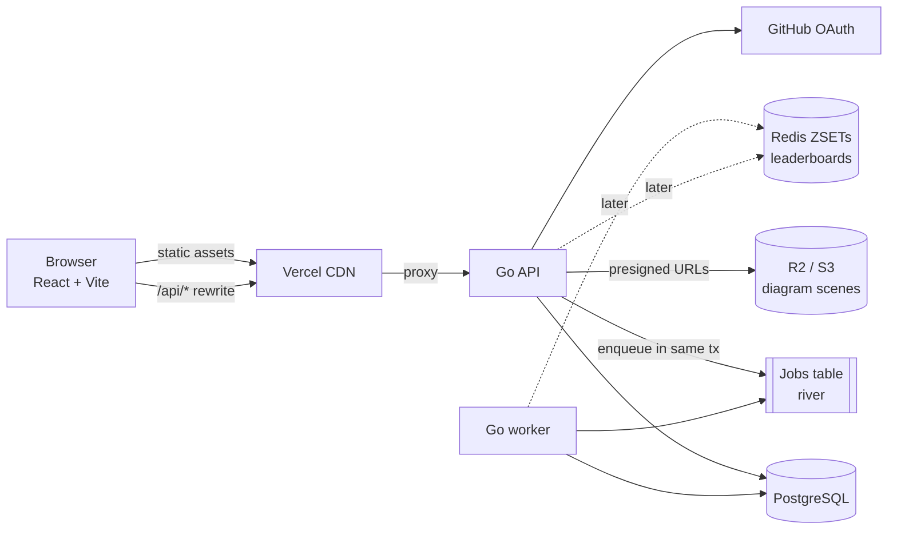
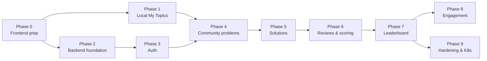

# Roadmap: from static site to a community platform

Goal: let users **add their own problem statements**, let others **submit solutions** (write-up + Excalidraw diagram), **review and score** them, and show a **leaderboard**.

Today the app is a static React + Vite site on Vercel. The 24 curated topics are code (`src/topics/curated.ts`, `src/diagrams/*.ts`, `docs/*.md`), and the only state is per-browser diagram edits in `localStorage`. Each phase below ships something usable on its own, and the static site keeps working through all of them.

---

## 1. Key decisions

### 1.1 Curated topics stay as code, community content goes in a database

The 24 curated topics are written with the diagram DSL and reviewed through PRs, which works well for them. Don't move them into a DB. User-generated content (problems, solutions, reviews) is a different kind of data: lots of authors, moderation, and raw Excalidraw scenes instead of DSL. The frontend reads from both sources and labels them as **Curated** or **Community**.

### 1.2 Backend options

| Option | Speed to ship | Control / learning value | Notes |
| --- | --- | --- | --- |
| **A. Supabase (BaaS)**: Postgres + Auth + Storage + Row Level Security | Fastest | Low | Business logic ends up in RLS policies and edge functions. Scoring and leaderboard jobs get awkward. |
| **B. Custom API in Go** + Postgres (+ Redis later) | Medium | High | Matches the Go / Kubernetes / distributed-systems learning goals. You own scoring, queues and leaderboards. |
| **C. Custom API in Node/TS (Fastify or NestJS)** | Medium-fast | Medium | Can share types with the frontend. Familiar stack. |

**Recommendation: B (Go).** The domain is small and well-bounded (CRUD, auth, a scoring pipeline, a leaderboard), so it's a good real project to learn Go on, and every part maps onto a topic this repo already documents (rate limiter, leaderboard, job scheduler, idempotency, outbox). If shipping fast matters more than learning, use **A**. The data model below still applies.

### 1.3 Recommended stack

| Concern | Choice | Why |
| --- | --- | --- |
| API | Go, `net/http` + `chi`, `pgx`, `sqlc` | Type-safe SQL without an ORM |
| API contract | OpenAPI 3.1 (`server/openapi.yaml`) → `oapi-codegen` (Go) + `openapi-typescript` (web) | One contract, typed on both sides |
| DB | PostgreSQL (Neon / Supabase-managed / RDS) | Relational data, JSONB for rubrics and scenes, full-text search, window functions for ranking |
| Migrations | `goose` or `golang-migrate` | Plain SQL files in Git |
| Background jobs | `river` (Postgres-backed queue) or a `SELECT … FOR UPDATE SKIP LOCKED` table | No extra infra; transactional enqueue (outbox for free) |
| Cache / leaderboard (later) | Redis sorted sets (Upstash or self-hosted) | Only once Postgres ranking gets slow |
| Object storage | Cloudflare R2 / S3 with presigned uploads | Large diagram scenes and images |
| Auth | GitHub OAuth → server-side session in an HTTP-only cookie | The audience is developers; no password storage |
| Frontend data layer | TanStack Query + React Router | Caching, mutations, real URLs instead of only `#/slug` |
| Hosting | Web stays on Vercel; API on Fly.io / Render first, Kubernetes later | Start simple, migrate to K8s as its own learning phase |

### 1.4 Same-origin API via a Vercel rewrite

Proxy `/api/*` from the Vercel domain to the API host:

```json
{ "rewrites": [{ "source": "/api/:path*", "destination": "https://api.<your-domain>/api/:path*" }] }
```

The browser then sees one origin. Session cookies are first-party (`SameSite=Lax`, no third-party cookie problems), and CORS isn't needed.

### 1.5 How to score system-design solutions (the hard part)

System design answers can't be auto-judged like LeetCode, so a solution's score is a combination of signals:

1. **Rubric-based peer review (primary).** Each problem has a rubric, for example: Requirements & scope, Capacity estimates, API, Data model, High-level design, Deep dives, Trade-offs & failure modes. Each criterion has a weight. Reviewers score each criterion 1–5 with a comment.
2. **Bayesian average**, so one 5★ review can't beat ten 4.6★ reviews:
   `score = (C·m + Σ wᵢ·rᵢ) / (C + Σ wᵢ)`
   Here `m` is the global mean review score, `C` is the prior strength (for example 3), and `wᵢ` is the reviewer's weight (based on reputation, capped, so new accounts count less).
3. **Upvotes (secondary).** A small, capped bonus, so popularity alone can't decide the ranking.
4. **AI-assisted first review (optional, later).** Claude grades the solution against the rubric as one weighted reviewer and gives instant feedback. It's never the sole judge.

**Points:** `points = round(score / 5 × difficultyPoints)` (Easy 50 / Medium 100 / Hard 200). Only the user's **best** solution per problem counts. Reviewers also earn a few points per review, more when their scores agree with the final consensus.

**Ledger, not counters.** Every point change is a row in an append-only `reputation_events` table, recorded as a delta (new − old), the same idea as the payment-system ledger. The leaderboard is `SUM(delta)`, which gives free weekly and monthly boards (filter by `created_at`), an audit trail, and easy recomputation.

**Anti-gaming:** no voting on or reviewing your own solutions; one review per user per solution; reviewer weight capped and dependent on account age and reputation; rate limits; and others' solutions **stay hidden until you submit your own** (prevents copying and keeps reviews independent).

---

## 2. Architecture



The API and worker can be **one binary** with two modes (`server api`, `server worker`), so there's one deploy now and they can scale separately later.

### 2.1 Data model (first cut)

```sql
users            (id, github_id UNIQUE, handle UNIQUE, name, avatar_url,
                  role TEXT CHECK (role IN ('user','moderator','admin')),
                  reputation INT DEFAULT 0, created_at)

sessions         (id_hash PK, user_id, expires_at, created_at, user_agent)

problems         (id, slug UNIQUE, title, summary, statement_md, difficulty,
                  category, tags TEXT[], rubric JSONB, author_id,
                  status TEXT CHECK (status IN ('draft','pending','published','rejected')),
                  search tsvector GENERATED, created_at, updated_at)

solutions        (id, problem_id, author_id, title, content_md,
                  scene_key TEXT,            -- object storage key, or scene JSONB if small
                  status TEXT CHECK (status IN ('draft','submitted')),
                  score NUMERIC, review_count INT, upvotes INT,
                  version INT, submitted_at, updated_at,
                  UNIQUE (problem_id, author_id))   -- one solution per user per problem, versioned

solution_versions(solution_id, version, content_md, scene_key, created_at,
                  PRIMARY KEY (solution_id, version))

reviews          (id, solution_id, reviewer_id, scores JSONB, total NUMERIC,
                  weight NUMERIC, comment_md, created_at,
                  UNIQUE (solution_id, reviewer_id))

votes            (user_id, solution_id, value SMALLINT, created_at,
                  PRIMARY KEY (user_id, solution_id))

comments         (id, solution_id, author_id, parent_id, body_md, created_at)

reputation_events(id, user_id, kind, ref_type, ref_id, delta INT,
                  idempotency_key UNIQUE, created_at)   -- append-only ledger

reports          (id, reporter_id, target_type, target_id, reason, status, created_at)
```

### 2.2 API sketch

```
GET    /api/auth/github/login            → redirect to GitHub
GET    /api/auth/github/callback         → create session cookie
POST   /api/auth/logout
GET    /api/me

GET    /api/problems?q=&tag=&difficulty=&cursor=
POST   /api/problems                     (auth) create draft
GET    /api/problems/{slug}
PATCH  /api/problems/{slug}              (author while draft/pending, moderator always)
POST   /api/problems/{slug}/submit       draft → pending
POST   /api/problems/{slug}/moderate     (moderator) publish / reject

GET    /api/problems/{slug}/solutions    hidden unless caller has submitted
PUT    /api/problems/{slug}/solutions/me (auth) upsert my draft
POST   /api/problems/{slug}/solutions/me/submit
POST   /api/uploads/scene                presigned PUT URL for a scene file

GET    /api/solutions/{id}
POST   /api/solutions/{id}/reviews       rubric scores + comment
PUT    /api/solutions/{id}/vote
GET    /api/solutions/{id}/comments
POST   /api/solutions/{id}/comments

GET    /api/leaderboard?window=all|month|week&problem=&cursor=
GET    /api/users/{handle}               profile, solutions, rank
```

Use cursor pagination everywhere and an `Idempotency-Key` header on POSTs that create things.

---

## 3. Phased plan

Each phase ends with something deployable. Sizes: **S** ≈ a few evenings, **M** ≈ 1–2 weeks part-time, **L** ≈ 2–4 weeks part-time.

### Phase 0: Prepare the frontend (S), no backend yet

- [x] Add **React Router** and move from `#/slug` to real routes (`/topics/:slug/:view?`, later `/problems/:slug`, `/leaderboard`, `/u/:handle`). Keep the old hash URLs working with a redirect. Add the SPA fallback to `vercel.json`.
- [x] Split `Topic` into a source-agnostic shape: `{ source: 'curated' | 'community', slug, title, …, doc, diagrams | scene }`. `DiagramView` should accept either a DSL `DiagramSpec[]` or a raw Excalidraw scene.
- [x] Add **TanStack Query** (unused for now) and a small `api/` client module.
- [x] Sidebar: group into **Curated** and **Community** sections.

Done when: same UX as today, cleaner seams, real URLs.

### Phase 1: "My Topics", local-only (S/M). Ships the user-facing feature right away

The originally requested feature, without a backend:

- [ ] **"New topic"** form: title, summary, category, tags, difficulty, problem statement (Markdown with live preview via the existing `react-markdown`).
- [ ] Blank Excalidraw canvas per topic (reuse `DiagramView`), with multiple tabs allowed.
- [ ] Store in **IndexedDB** (scenes outgrow the ~5 MB `localStorage` quota), for example via `idb-keyval`.
- [ ] **Export / import** a topic as one `.json` file (statement + scenes), so it can be shared before a backend exists.
- [ ] Shown under **My Topics** in the sidebar.

Done when: a user can create, edit, delete, export and import their own topics, and they survive reloads. The editor UI is the same one Phase 4 uses for solutions.

### Phase 2: Backend foundation (M)

- [ ] `server/` Go module (keep the web app at the repo root to avoid churn; move to `apps/web` + `apps/api` later if it grows).
- [ ] `openapi.yaml` as the contract, with codegen for Go handlers and TS types.
- [ ] Postgres + migrations, `sqlc` queries, `docker-compose.yml` for local Postgres.
- [ ] Health/readiness endpoints, structured logging (`slog`), request IDs, graceful shutdown, config from env.
- [ ] CI: `go vet`, `golangci-lint`, `go test` against a real Postgres (testcontainers or a service container), plus the existing web build.
- [ ] Deploy the API (Fly.io/Render) and add the Vercel `/api/*` rewrite.

Done when: `GET /api/health` works through the Vercel domain, and CI runs on both apps.

### Phase 3: Authentication & users (S/M)

- [ ] GitHub OAuth (authorization code flow with `state`; PKCE optional for a confidential client).
- [ ] Server-side sessions: random 256-bit token in an `HttpOnly; Secure; SameSite=Lax` cookie, storing only its **hash** in `sessions`. Use sliding expiry.
- [ ] CSRF: same-origin plus an `Origin`/`Sec-Fetch-Site` check on mutating requests.
- [ ] `GET /api/me`, profile page, sign-in button in the top bar.
- [ ] Roles: `user`, `moderator`, `admin` (seed yourself as admin).

Done when: users can sign in with GitHub and see their profile.

### Phase 4: Community problems (M)

- [ ] CRUD API for problems, with status workflow `draft → pending → published | rejected`.
- [ ] A **"Publish to community"** button on a local topic from Phase 1 (upload statement + scenes).
- [ ] Moderation queue for moderators (approve/reject with reason).
- [ ] Default rubric template that authors can tweak (weights must sum to 100).
- [ ] Search with Postgres full-text search (`tsvector` + GIN), plus `pg_trgm` for fuzzy titles.
- [ ] Safety: Markdown rendered **without raw HTML** (keep `react-markdown` defaults, no `rehype-raw`), size limits on statements and scenes, reject scenes with embedded data-URL images over N KB, rate-limit creation.

Done when: published community problems appear in the sidebar for everyone.

### Phase 5: Solutions (M/L)

- [ ] Solution editor = Markdown write-up + Excalidraw canvas, autosaved as a draft (debounced `PUT …/solutions/me`).
- [ ] Scenes go to object storage through presigned PUTs, with `scene_key` stored in Postgres (small scenes can stay inline as JSONB).
- [ ] Submit → becomes immutable as a version; editing later creates a new version.
- [ ] **Reveal rule:** others' solutions are visible only after you submit (or after you click an explicit "give up and view").
- [ ] Solution page: read-only canvas + write-up + author + score.

Done when: users can submit and view solutions to any published problem.

### Phase 6: Reviews, votes & scoring (M/L)

- [ ] Review form generated from the problem's rubric (per-criterion 1–5 + comment).
- [ ] Upvotes and threaded comments.
- [ ] **Scoring worker:** a review/vote insert enqueues `recompute_solution_score(solution_id)` in the **same transaction** (transactional outbox via river or a jobs table). The worker recomputes the Bayesian score, updates `solutions.score`, computes the user's best-per-problem points, and writes a **delta** to `reputation_events` with an idempotency key such as `solution:{id}:v{scoreVersion}`, so retries are safe.
- [ ] Anti-abuse rules from §1.5. Rate limits (token bucket per user/IP; see `docs/rate-limiter.md`).
- [ ] Notifications (in-app first): "your solution got a review".

Done when: scores update within seconds of a review, and reputation is fully derivable from the ledger.

### Phase 7: Leaderboard (S/M)

- [ ] **v1 in Postgres**: `SELECT user_id, SUM(delta) AS pts, RANK() OVER (ORDER BY SUM(delta) DESC) …` with a `created_at` filter for week/month. Precompute it as a materialized view refreshed every minute by the worker (`REFRESH MATERIALIZED VIEW CONCURRENTLY`).
- [ ] Views: global (all-time / month / week), per problem (top solutions), and "my rank" (with neighbours ±5).
- [ ] **v2 in Redis, only when needed** (refresh too slow, or you want real-time): the worker does `ZINCRBY lb:all`, `lb:2026-W41`, `lb:2026-10` per ledger event, and Postgres stays the source of truth with a rebuild job. This is the design in `docs/leaderboard.md`, built for real.

Done when: `/leaderboard` shows correct, tie-aware ranks, and the numbers match a recompute from the ledger.

### Phase 8: Quality & engagement (M, pick and choose)

- [ ] AI-assisted rubric review via the Claude API as one weighted reviewer, plus instant feedback for the author. Runs async in the worker with a per-user daily quota.
- [ ] Badges (first solution, 10 reviews, top 10% on a problem), streaks.
- [ ] Reports & moderation tools (hide content, ban user, audit log).
- [ ] Email digests and notification preferences.
- [ ] "Fork a curated topic": start a solution from a curated diagram.

### Phase 9: Production hardening & Kubernetes (M/L, a learning track)

- [ ] Observability: OpenTelemetry traces, Prometheus metrics (p95 latency, job lag, error rate), dashboards, alerts.
- [ ] Backups + restore drill, PITR on Postgres.
- [ ] Load test (k6) the read paths: problem list, solution page, leaderboard.
- [ ] Move the API and worker to **Kubernetes** (k3s/kind locally → EKS/GKE or a managed k3s): Deployments for `api` and `worker`, HPA, PodDisruptionBudgets, readiness/liveness probes, secrets via External Secrets, migrations as a pre-deploy Job, ingress + cert-manager.
- [ ] CDN caching for public GETs (`Cache-Control: s-maxage` + `stale-while-revalidate` on problem and leaderboard reads).

---

## 4. Suggested order and milestones



| Milestone | Phases | What users get |
| --- | --- | --- |
| **M1: Create** | 0, 1 | Add, edit and export your own topics (no account) |
| **M2: Share** | 2, 3, 4 | Sign in with GitHub, publish problems for everyone |
| **M3: Compete** | 5, 6, 7 | Submit solutions, peer review, scores, leaderboard |
| **M4: Grow** | 8, 9 | AI feedback, badges, production-grade ops |

Phases 1 and 2 are independent and can run in parallel.

---

## 5. Open questions to settle before Phase 4

1. Moderation: should every new problem be approved by a moderator, or should trusted users (reputation above X) publish directly?
2. License for user content (for example CC BY-SA), stated in the submission form.
3. Should solutions be editable after reviews arrive? (Proposal: yes as a new version; reviews stay attached to the version they reviewed, and the score uses the latest reviewed version.)
4. Minimum reviews before a solution counts toward the leaderboard (proposal: 3).
5. Is the AI reviewer in scope for launch, or a later experiment?
